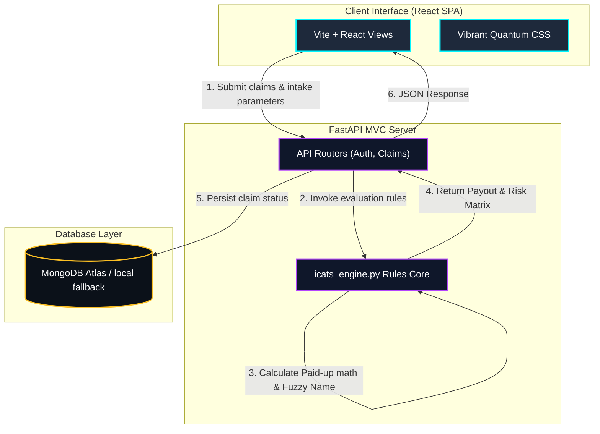

# ICATS - Insurance Claim Assistance & Tracking System

**ICATS** is a rule-based **Decision Intelligence System** that translates statutory regulations (such as Section 113 and Section 45 of the Insurance Act, 1938) and compliance workflows into an automated claims validation pipeline. 

Designed for claimant nominees, bank intermediaries, and insurance assessors, ICATS replaces legacy manual claim triage with a deterministic, explainable, and visually striking decision engine.

---

## 1. What We Resolve (Core Problem Resolutions)

Settling life insurance claims is traditionally slow, error-prone, and heavily audited. ICATS resolves these key operational bottlenecks:

### 1.1 Dynamic Intake & Document Compliance Checklists
* **The Problem:** Accidental deaths require police documents (FIR, Post-Mortem Reports), while natural deaths require clinical summaries. Manual review causes endless delay back-and-forth loops.
* **The Solution:** The rules engine dynamically updates the required documentation checklist based on the cause of death. If an early natural claim is flagged, it automatically requests hospital case files.

### 1.2 Fuzzy Name Inversion Auditing (Levenshtein Distance)
* **The Problem:** Nominee names in policy contracts (e.g., `"Sunita Devi"`) often differ from the bank account cheque name (e.g., `"Sunita Kumar"` or `"Sunita D."`), causing bank transfer rejections.
* **The Solution:** Strips common titles, sorts name tokens alphabetically (matching name inversions like `"Ramesh Kumar"` vs `"Kumar Ramesh"`), and calculates edit-distance similarity. If it fails the matching threshold, it auto-generates a notarization-ready "One and the Same Person" name affidavit.

### 1.3 Statutory Paid-Up Payouts (Section 113)
* **The Problem:** Lapsed policies usually pay out zero. However, under Section 113 of the Insurance Act, if premiums were paid for at least 3 years, the policy legally acquires a Reduced Paid-Up status.
* **The Solution:** The system detects policy lapses, verifies eligibility, and automatically calculates the statutory payout amount:
  $$\text{Payout} = \left(\frac{\text{Premiums Paid Years}}{\text{Premium Paying Term}}\right) \times \text{Sum Assured}$$

### 1.4 Section 45 Medical Fraud & Risk Modifiers
* **The Problem:** Insurers must audit deaths occurring within 3 years of policy commencement to prevent pre-existing health fraud.
* **The Solution:** The engine calculates policy age and flags early claims. If hospital case files reveal chronic ICD-10 medical codes (such as `N18.9` for kidney failure), it applies a +30 risk modifier. An aggregate risk score above 70 automatically overrides decisions and rejects the claim.

### 1.5 Explainable Rules Execution Trace Logs
* **The Problem:** Modern automated decision systems operate as black boxes, making auditing difficult.
* **The Solution:** ICATS outputs a step-by-step monospace console log detailing exactly which rules were evaluated, which failed, and the confidence level of the decision.

---

## 2. Technology Stack Selection

We selected a decoupled, modern stack to optimize performance, portability, and user experience:

| Technology | Selection Rationale |
| :--- | :--- |
| **Python FastAPI (Backend)** | High-performance asynchronous routing, automatic OpenAPI generation, and lightweight memory footprint. Perfect for running rule math and date calculations. |
| **Vite + React (Frontend)** | Modern SPA architecture featuring instantaneous Hot Module Replacement (HMR) and modular, component-based view rendering. |
| **MongoDB Atlas** | Document-based store that natively models polymorphic claim dossiers, tracking status arrays, and logs as structured JSON documents. Falls back to a local JSON database if offline. |
| **Vanilla CSS ("Neon Quantum")** | Customized styling variables to deliver a colorful, high-fidelity dark-mode interface with linear gradients, metallic shadows, and glowing cyber accents for data values. |

---

## 3. Project Architecture



---

## 4. File Structure

The project follows a decoupled, clean MVC structure:

```text
├── app/                      # Backend FastAPI application
│   ├── api/                  # API routing endpoints (Auth, Claims, Video)
│   ├── core/                 # App configurations and MongoDB connection lifecycle
│   ├── repositories/         # Database query wrappers
│   ├── services/             # Core business logic handlers
│   ├── utils/                # Rules decision engine & JWT helper
│   ├── views/                # Direct static views (Vanilla JS fallback)
│   └── .env                  # Backend credentials (ignored by git)
├── frontend/                 # Frontend Vite React SPA
│   ├── src/                  # React source components and routing logic
│   │   ├── components/       # Reusable layout cards (Wizard, Tracker, etc.)
│   │   └── index.css         # Neon Quantum styling stylesheet
│   ├── vite.config.js        # Development environment loader and proxy configuration
│   └── .env                  # Frontend variables (ignored by git)
├── .gitignore                # Global project ignores
└── README.md                 # Project document
```

---

## 5. Getting Started (Deployment)

Backend and frontend configurations are fully separated to make deployments easy.

### 5.1 Configure Environment Variables

**1. Backend Config (`app/.env`):**
Create an `.env` file inside the `app/` folder:
```env
MONGO_URI=mongodb+srv://<username>:<password>@cluster.mongodb.net/?appName=ICATS
MONGO_DB_NAME=icats_db
HOST=127.0.0.1
PORT=8000
```

**2. Frontend Config (`frontend/.env`):**
Create an `.env` file inside the `frontend/` folder:
```env
VITE_API_URL=http://127.0.0.1:8000
```

### 5.2 Start the Applications

**1. Launch the Backend API:**
```powershell
pip install -r requirements.txt
python -m uvicorn app.main:app --host 127.0.0.1 --port 8000
```

**2. Launch the Frontend Dev Server:**
```powershell
cd frontend
npm install
npm run dev
```
Open your browser to `http://localhost:5173/` to interact with the portal.
